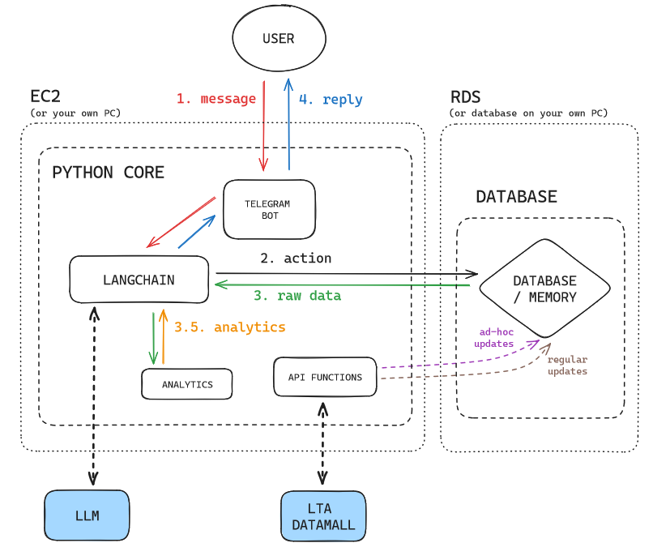

# RouteWise

RouteWise is a chatbot that integrates data from various sources to provide real-time, personalized traffic guidance and route suggestions through the Telegram platform.

## Architecture



## Development

Create a virtual environment with Python 3.10 and install required libraries from `requirements.txt` using Conda:

```bash
# If you do not have an environment made
conda create --name <envname> python=3.10 --file requirements.txt

# If environment exists and is activated
conda install --file requirements.txt
```

If that is not working, run the following command to install the essential libraries from Pip.

```bash
pip install pandas numpy bs4 langchain langchain-experimental langchain-openai python-telegram-bot python-dotenv tabulate boto3 sqlalchemy psycopg2-binary
```

**NOTE:** Running this application requires environmental variables to be in place for all essential API keys and passwords. You will not be able to run it without the environmental variables or the correct `.env` file.
